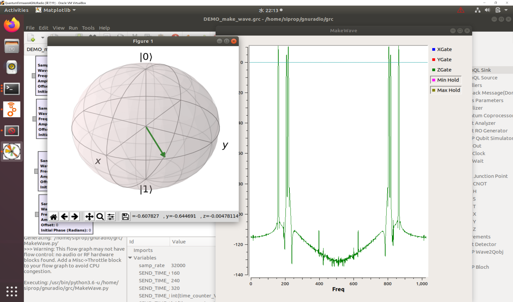
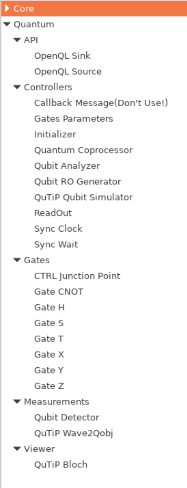
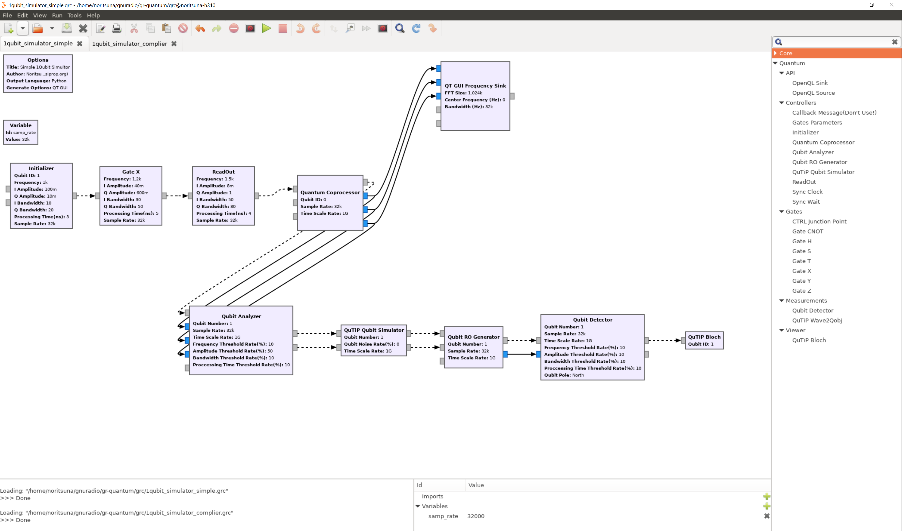
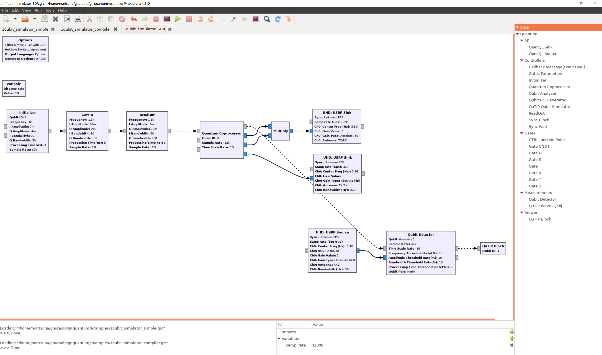
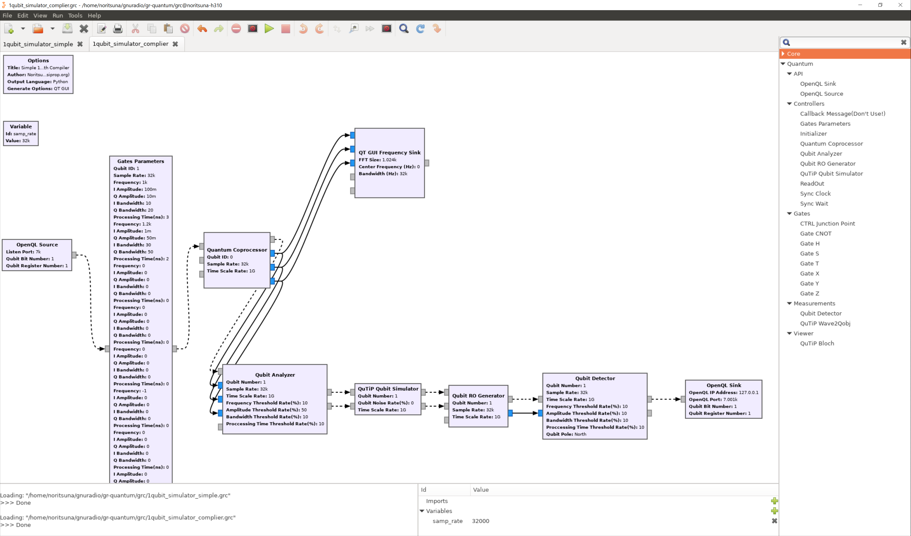

# GR-Quantum
GNU Radio Blocks for Quantum Firmware.
These blocks are a Controller of Real Quantum Computer(One of the Quantum Firmware for The Superconducting Quantum Computer) and a Simulator of Quantum Firmware on GNU Radio.

## Installation
First you need to install the dependencies (see below).

### Build GNU Radio
These blocks require the GNU Radio 3.8.0.0 or new with the Python 3.6 on Ubuntu 18.04 or the GNU Radio 3.8.1.0 or new with the Python 3.7 on Ubuntu 20.04 or the GNU Radio 3.8.1.0 or new with the Python 3.7 on Rasbian(Raspberry Pi).  
First, Please build and setup GNU Radio from source code with Python 3.6 or Python3.7.

    $ sudo apt install git cmake g++ libboost-all-dev libgmp-dev libcppunit-dev swig python3 python3-dev python3-pip python3-numpy python3-mako python3-sphinx python3-lxml doxygen libfftw3-dev libcomedi-dev libsdl1.2-dev libgsl-dev libqwt-qt5-dev libqt5opengl5-dev python3-pyqt5 liblog4cpp5-dev libzmq3-dev python3-yaml python3-click python3-click-plugins
    $ sudo pip uninstall pybombs
    $ sudo pip3 install pybombs
    $ pybombs recipes add gr-recipes git+https://github.com/gnuradio/gr-recipes.git
    $ pybombs recipes add gr-etcetera git+https://github.com/gnuradio/gr-etcetera.git

Second, Please edit lwr file for GNU Radio.  

    ~/.pybombs/recipes/gr-recipes/gnuradio.lwr

> Add "-DENABLE_CTRLPORT_THRIFT=OFF" in "config_opt" line.

    config_opt: " -DENABLE_CTRLPORT_THRIFT=OFF -DENABLE_DOXYGEN=$builddocs -DENABLE_GR_AUDIO=ON -DENABLE_GR_BLOCKS=ON -DENABLE_GR_DIGITAL=ON -DENABLE_GR_FEC=ON -DENABLE_GR_FFT=ON -DENABLE_GR_FILTER=ON -DENABLE_GR_QTGUI=ON -DENABLE_GR_UHD=ON -DENABLE_PYTHON=ON -DENABLE_VOLK=ON -DENABLE_GRC=ON "

Third, Please initialize PYBOMBS.   

    $ mkdir -p ~/gnuradio/gnuradio38
    $ pybombs prefix init ~/gnuradio/gnuradio38

Forth, Please edit setup_env.sh file for GNU Radio.   

    ~/gnuradio/gnuradio38/setup_env.sh

> Ubuntu 18.04 : Change "python2.6" paths to "python3.6" in PYTHONPATH.  
> Ubuntu 20.04 : Change "python2.6" paths to "python3.8" in PYTHONPATH.  
> Raspberry Pi : Change "python2.6" paths to "python3.7" in PYTHONPATH.  
> Delete "python2.7" paths in PYTHONPATH.  
> Add "python3" paths in PYTHONPATH.  

Ubuntu 18.04 : 
    export PYTHONPATH="/home/siprop/gnuradio/gnuradio38/python:/home/siprop/gnuradio/gnuradio38/lib/python3.6/site-packages:/home/siprop/gnuradio/gnuradio38/lib64/python3.6/site-packages:/home/siprop/gnuradio/gnuradio38/lib/python3.6/dist-packages:/home/siprop/gnuradio/gnuradio38/lib64/python3.6/dist-packages:/home/siprop/gnuradio/gnuradio38/lib/python3/site-packages:/home/siprop/gnuradio/gnuradio38/lib64/python3/site-packages:/home/siprop/gnuradio/gnuradio38/lib/python3/dist-packages:/home/siprop/gnuradio/gnuradio38/lib64/python3/dist-packages$PYTHONPATH"

Ubuntu 20.04 :
    export PYTHONPATH="/home/siprop/gnuradio/gnuradio38/python:/home/siprop/gnuradio/gnuradio38/lib/python3.8/site-packages:/home/siprop/gnuradio/gnuradio38/lib64/python3.8/site-packages:/home/siprop/gnuradio/gnuradio38/lib/python3.8/dist-packages:/home/siprop/gnuradio/gnuradio38/lib64/python3.8/dist-packages:/home/siprop/gnuradio/gnuradio38/lib/python3/site-packages:/home/siprop/gnuradio/gnuradio38/lib64/python3/site-packages:/home/siprop/gnuradio/gnuradio38/lib/python3/dist-packages:/home/siprop/gnuradio/gnuradio38/lib64/python3/dist-packages$PYTHONPATH"

Raspberry Pi :
    export PYTHONPATH="/home/siprop/gnuradio/gnuradio38/python:/home/siprop/gnuradio/gnuradio38/lib/python3.7/site-packages:/home/siprop/gnuradio/gnuradio38/lib64/python3.7/site-packages:/home/siprop/gnuradio/gnuradio38/lib/python3.7/dist-packages:/home/siprop/gnuradio/gnuradio38/lib64/python3.7/dist-packages:/home/siprop/gnuradio/gnuradio38/lib/python3/site-packages:/home/siprop/gnuradio/gnuradio38/lib64/python3/site-packages:/home/siprop/gnuradio/gnuradio38/lib/python3/dist-packages:/home/siprop/gnuradio/gnuradio38/lib64/python3/dist-packages$PYTHONPATH"

Fifth, Please build the GNU Radio.   

    $ source ~/gnuradio/gnuradio38/setup_env.sh
    $ cd ~/gnuradio/gnuradio38
    $ pybombs install gnuradio

### Build QuTiP
First, Please build and setup [QuTiP](http://qutip.org/) from source code .  

    $ sudo apt install libomp-dev
    $ sudo pip3 install numpy scipy cython matplotlib pytest pytest-cov jupyter notebook spyder
    $ mkdir ~/qutip
    $ cd ~/qutip
    $ wget http://qutip.org/downloads/4.5.0/qutip-4.5.0.tar.gz
    $ tar zxfv qutip-4.5.0.tar.gz
    $ cd qutip-4.5.0
    $ sudo python3 setup.py install -–with-openmp

### Build GR-Quantum
First, Please setup [liboscpack1](https://packages.ubuntu.com/xenial/libs/liboscpack1).

    $ sudo apt install liboscpack1 liboscpack-dev

Second, Please build and setup GR-Quantum library for GNU Radio.  

    $ cd ~/gnuradio
    $ git clone https://github.com/noritsuna/gr-quantum
    $ cd gr-quantum
    $ mkdir build
    $ cd build
    $ cmake [Each OS's options]
    $ make install
    $ sudo ldconfig

Ubuntu 18.04 : 
    $ cmake --prefix=/home/siprop/gnuradio/gnuradio38 -DPYTHON_EXECUTABLE=/usr/bin/python3 -DPYTHON_LIBRARY=/usr/lib/x86_64-linux-gnu/libpython3.6m.so -DPYTHON_INCLUDE_DIR=/usr/include/python3.6m -DGNURADIO_RUNTIME_INCLUDE_DIRS=/home/siprop/gnuradio/gnuradio38/include -DGNURADIO_RUNTIME_LIBRARIES=/home/siprop/gnuradio/gnuradio38/lib -DENABLE_DOXYGEN=OFF ../

Ubuntu 20.04 : 
    $ cmake --prefix=/home/siprop/gnuradio/gnuradio38 -DPYTHON_EXECUTABLE=/usr/bin/python3 -DPYTHON_LIBRARY=/usr/lib/x86_64-linux-gnu/libpython3.8.so -DPYTHON_INCLUDE_DIR=/usr/include/python3.8 -DGNURADIO_RUNTIME_INCLUDE_DIRS=/home/siprop/gnuradio/gnuradio38/include -DGNURADIO_RUNTIME_LIBRARIES=/home/siprop/gnuradio/gnuradio38/lib -DENABLE_DOXYGEN=OFF ../

Rasbian(Raspberry Pi) : 
    $ cmake --prefix=/home/siprop/gnuradio/gnuradio38 -DPYTHON_EXECUTABLE=/usr/bin/python3 -DPYTHON_LIBRARY=/usr/lib/arm-linux-gnueabihf/libpython3.7m.so -DPYTHON_INCLUDE_DIR=/usr/include/python3.7m -DGNURADIO_RUNTIME_INCLUDE_DIRS=/home/siprop/gnuradio/gnuradio38/include -DGNURADIO_RUNTIME_LIBRARIES=/home/siprop/gnuradio/gnuradio38/lib -DENABLE_DOXYGEN=OFF ../

### Run GNU Radio with GR-Quantum
Load Environment Variables and Run gnuradio-companion.  

    $ source ~/gnuradio/gnuradio38/setup_env.sh
    $ gnuradio-companion

## Dependencies
Required dependencies:

  * [QuTiP](http://qutip.org/)
  * [liboscpack1](https://packages.ubuntu.com/xenial/libs/liboscpack1)
  * [OpenQL](https://github.com/openql-org/openql.org)

## Usage Quantum Blocks

### Gates(Quantum Logic Gates)
- X
  - Bit Inversion Operation
- Y
  - Phase Inversion Operation
- Z
  - Phase & Bit Inversion Operation
- H
  - Hadamard Operation
- S
  - Pai/2 Phase Shift Operation
- T
  - Pai/4 Phase Shift Operation
- CNOT
  - Controlled NOT Gates
- CTRL junction point
  - Controlled Gates Effect Point

### Controllers
- ReadOut
  - ReadOut Operation
- Initializer
  - Initialize the Qubit Operation
- Quantum Coprocessor
  - Interpret Quantum Logic Gates Blocks's Flow and Send Gate's Wave, CTRL's Wave and RO Wave
- Qubit Analyzer
  - Analyze Gate's Wave to Gate Type
- Qubit RO Generator
  - Generate & Send ReadOut Wave
- Qubit XXX Simulator
  - Qubit Circuit Simulator using XXX Library
- Sync Wait
  - Wait(ns) in Quantum Coprocessor
- Sync Clock
  - Synchronize each Gates
- Gates Prameters
  - All Quantum Logic Gates's Parameters List for API

### Measurements
- Qubit Detector
  - Detecte RO Wave as the Qubit's Vector(Angle)
- QuTiP Wave2Qobj
  - Convert the RO Wave to QuTiP's Qobj

### Viewer
- Constellation
  - Show the Matrix Histogram of Multi Qubits
- Bloch
  - Show the Bloch Sphere of 1 Qubit

### API
- OpenQL Source
  - Receive the Operation of each Qubits from OpenQL Quantum Simulator
- OpenQL Sink
  - Send the Result of each Qubits' Operation to OpenQL Quantum Simulator

## How to Use Quantum Blocks
### 1 Qubit Simulator
1. Make a Qubit Circuit using Gates Blocks as GNU Radio Flow. And You have to use the Initializer Block as First Flow  and the Readout Block as Last Flow.
1. Setup All Gates' Parameters(Frequency, I Amplitude Q Amplitude, I Bandwaidth, Q Bandwidth, Processing Time and Qubit ID in the Initializer Block Only). And You have to setup Same Gate Type is Same parameters.
1. Setup the Quantum Coprocessor Block, Connect it to the Qubit Circuit. Time Scale Rate is Processing Time's Rate(Time Scale Rate is 1M, Processing Time is changed nano sec to milli sec.). And If you setup the Initializer Block, you don't need to setup Qubit ID. 
1. Setup a Simulator Part. The Simulator Part is composed by the Qubit Analyzer Block, the QuTiP Qubit Simulator Blcok, the Qubit RO Generator Block.
1. Setup a View Qubit Part. The View Qubit Poart is composed by the Qubit Detector Block and the QuTiP Bloch Block.

  * [1qubit_simulator_simple.grc](./examples/1qubit_simulator_simple.grc)

### 1 Qubit for a Real Quantum Computer using SDR
1. Make a Qubit Circuit using Gates Blocks as GNU Radio Flow. And You have to use the Initializer Block as First Flow  and the Readout Block as Last Flow.
1. Setup All Gates' Parameters(Frequency, I Amplitude Q Amplitude, I Bandwaidth, Q Bandwidth, Processing Time and Qubit ID in the Initializer Block Only). And You have to setup Same Gate Type is Same parameters.
1. Setup the Quantum Coprocessor Block, Connect it to the Qubit Circuit. Time Scale Rate is Processing Time's Rate(Time Scale Rate is 1M, Processing Time is changed nano sec to milli sec.). And If you setup the Initializer Block, you don't need to setup Qubit ID. 
1. Connect the Quantum Coprocessor Block to SDR's sink. And Setup a center Frequency for the Real Quantum Computer.
1. Connect the Qubit Detector Block from SDR's source. And Setup a center Frequency for the Real Quantum Computer.
1. Setup a View Qubit Part. The View Qubit Poart is composed by the Qubit Detector Block.

  * [1qubit_simulator_SDR.grc](./examples/1qubit_simulator_SDR.grc)

### 1 Qubit Simulator with OpenQL
1. Setup a Receive Qubit Operation Part. The Receive Qubit Operation Part is composed by the OpenQL Source Block and Setup the Gates Parameters Block. You have to input All Gates' Parameters(Frequency, I Amplitude Q Amplitude, I Bandwaidth, Q Bandwidth, Processing Time and Qubit ID).
1. Setup the Quantum Coprocessor Block, Connect it to the Qubit Circuit. Time Scale Rate is Processing Time's Rate(Time Scale Rate is 1M, Processing Time is changed nano sec to milli sec.). And If you setup the Initializer Block, you don't need to setup Qubit ID. 
1. Setup a Simulator Part. The Simulator Part is composed by the Qubit Analyzer Block, the QuTiP Qubit Simulator Blcok, the Qubit RO Generator Block.
1. Setup a Return Qubit Part. The Return Qubit Poart is composed by the Qubit Detector Block and the OpenQL Sink Block.

  * [1qubit_simulator_compiler.grc](./examples/1qubit_simulator_compiler.grc)

### 2 Qubits or more Qubits Simulator
1. We are developing this now.
